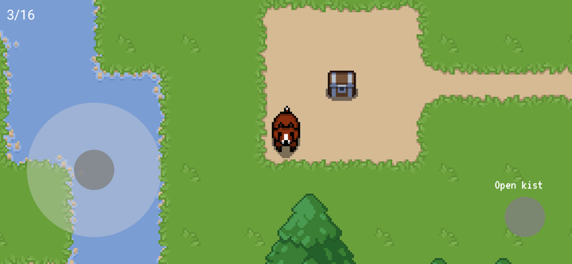

# Smittie2

A little surprise game I made for my sister-in-law and her husband when they got their second child. For their first child I also created a surprise app so this time I had to up my game.

## The game
The game is relatively simple. The goal is to find all the treasure chests which correspond to real-life presents in a digital forest.

## Tools
The game is made with the following tools/frameworks:
- [Flutter](https://flutter.dev/)
- [Flame game engine](https://flame-engine.org/)
- [Tiled map editor](https://www.mapeditor.org/)
- [Stable Diffusion](https://stablediffusionweb.com/) (for some image generation)

## Run
Install the flutter sdk and run `flutter pub get` to fetch all the dependencies. Run `flutter run` to run the game.
